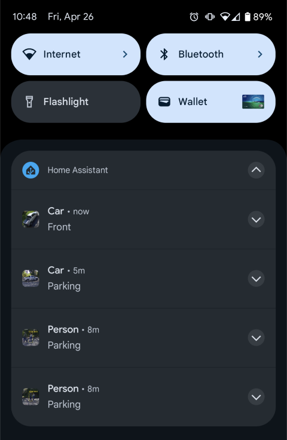

# Frigate Notifications

## Purpose of this add-on

This add-on will send notifications to [ntfy](https://ntfy.sh), or the Home Assistant companion app when an object is detected by Frigate.  You can use either ntfy, the Home Assistant companion app, or both.

The notification will include a snapshot of the object. Clicking/tapping on the snapshot will open a full size version of the snapshot. Clicking/tapping on the title of the notification will open the video of the triggering event.

## ntfy

Example of the notification tray on Android:

Example of the notifications in the ntfy app on Android:

Example of the nofitications in the ntfy web ui:

## Home Assistant companion app

Example of the notification in the Home Assistant companion app on Android:

## Pushover

Example of the notification in the Pushover app on Android:

## Installation

In Home Assistant, go to Settings -> Add-ons -> Add-on store -> ... button (top right) -> Repositories -> Add "https://github.com/chunkystyles/frigate_notifications_haos_addon"

Once added, you will see the "Frigate Notifications" add-on in the list of available add-ons.  Click on that, then click "Install".

Then go to the "Configuration" tab and fill in the required fields. See the [documentation](src/DOCS.md) for more information.
